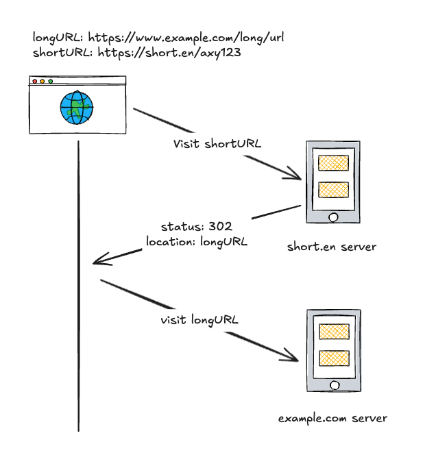

# Back-end Approach: URL Shortener Service

> Content inspired from: [System Design Interview An Insider's Guide by Alex Yu](https://www.amazon.com/System-Design-Interview-insiders-Second/dp/B08CMF2CQF)

*The requirements outlined in the roadmap.sh ([URL Shortening Service](https://roadmap.sh/projects/url-shortening-service)) are clear, but I would like to elaborate on them further.*

## Table of Contents

1. [Requirements Exploration](#requirements-exploration)
   - [Q&A for URL Shortener Service](#qa-for-url-shortener-service)
   - [Basic Use Cases](#basic-use-cases)
   - [Back of the Envelope Estimation](#back-of-the-envelope-estimation)
2. [High-level Design](#high-level-design)
   - [URL Redirecting](#url-redirecting)
   - [URL Shortening](#url-shortening)
   - [API Endpoint](#api-endpoint)
3. [Design Deep Dive](#design-deep-dive)
4. [Optimizations and Improvement](#optimizations-and-improvement)

## Requirements Exploration

### Q&A for URL Shortener Service

**Question:** Can you give an example of how a URL shortener works?

**Answer:** Assume URL [https://www.systeminterview.com/q=chatsystem&c=loggedin&v=v3&l=long](https://www.systeminterview.com/q=chatsystem&c=loggedin&v=v3&l=long) is the original URL. Your service creates an alias with shorter length: [https://tinyurl.com/y7keocwj](https://tinyurl.com/y7keocwj). If you click the alias, it redirects you to the original URL.

**Question:** What is the traffic volume?

**Answer:** 500 million URLs are generated per month.

**Question:** How long is the shortened URL?

**Answer:** As short as possible.

**Question:** What characters are allowed in the shortened URL?

**Answer:** Shortened URL can be a combination of numbers (0-9) and characters (a-z, A-Z).

**Question:** Can shortened URLs be deleted or updated?

**Answer:** Yes, the owner could update and delete their URLs

**Question:** How do we identify the owner of a URL?

**Answer:** Let's generate a unique string key when the user creates a shortened link. This key can be used to update or delete the link.

### Basic Use Cases

1. **URL Redirecting:** Given a shorten URL, redirect to the original URL.
2. **URL Shortening:** Create shorten URL from the original URL.
3. **Update Short URL:** Update an existing shorten URL.
4. **Delete Short URL:** Delete an existing shorten URL.
5. **Get URL Statistics:** Retrieve statistics for the shorten URL (e.g., number of times accessed).
6. **High Availability, Scalability, and Fault Tolerance Considerations**

### Back of the Envelope Estimation

- **Traffic Estimation:**
  - **Write Operation:** 500 million URLs are generated per month.
  - **Write Operation per Second:** 500 million / (30 x 24 x 3600) = 200 URLs/s
  - **Read Operation:** With a read:write ratio of 100:1, read operations per second: 200 x 100 = 20,000 URLs/s

- **Storage Estimation:**
  - **Total Records over 5 Years:** With 500 million URLs generated per month, over 5 years we will have: 500 million x 12 x 5 = 30 billion URLs
  - **Storage Requirement:** Assuming each shortened URL requires 500 bytes of storage, the storage requirement over 5 years: 30 billion x 500 bytes = 15 TB

- **Bandwidth Estimation:**
  - **Incoming Data:** With 200 new URLs per second, incoming data: 200 x 500 bytes = 100 KB/s
  - **Outgoing Data:** With 20,000 read requests per second, outgoing data: 20,000 x 500 bytes = 10 MB/s

- **Memory Estimation:**
  - To improve system performance, we will cache frequently accessed shortened URLs.
  - Following the 80:20 rule, 20% of the shortened URLs generate 80% of the traffic.
  - With 20,000 requests per second, daily requests: 20,000 x 3600 x 24 = 1.7 billion requests/day
  - To cache 20% of these requests, memory required: 0.2 x 1.7 billion x 500 bytes = 170 GB

- **System Summary:**
  - 200 URLs are created per second
  - 20,000 requests per second
  - Incoming data: 100 KB/s
  - Outgoing data: 10 MB/s
  - Storage requirement over 5 years: 15 TB
  - Memory required for caching: 170 GB

## High-level Design

### URL Redirecting

There are two ways to handle URL redirection: using HTTP status codes 301 and 302.

1. **301 Moved Permanently:**
   - Indicates the URL has been permanently moved.
   - Browsers cache the redirection and search engines update their indexes.
   - Not suitable for frequently changing URLs or tracking clicks.

2. **302 Found (Temporary Redirect):**
   - Indicates the URL is temporarily located at a different URL.
   - Browsers do not cache the redirection and search engines do not update their indexes.
   - Suitable for frequently changing URLs and tracking clicks.

Because we want to update the URL and track clicks, we will use the 302 status code for our URL redirection.



Figure 2: Visual representation of URL redirection process

### URL Shortening

We will need to convert the long URL to a short code, and the short code could be mapped back to the long URL

```https://www.example.com/very/long/url``` -> ```<<baseURL>>/{shortCode}```

We will be doing that via a hash function, the long URL will be hash to be a short code: ```shortCode = hashFx(longURL)```

### API Endpoint

The URL Shortener service will expose the following API endpoints to support the basic use cases:

<details>
<summary>1. Create Short URL</summary>

- **Endpoint:** `/api/v1/shorten_urls`
- **Method:** `POST`
- **Description:** Create a shortened URL from the original URL. The response includes a unique key that can be used to modify the shortened URL and a shorten_code that will be used for redirection.
- **Request Body:**

  ```json
  {
    "original_url": "https://www.example.com/very/long/url"
  }
  ```

- **Response:**

  ```json
  {
    "key": "unique_key_for_modification",
    "shorten_code": "shortCode"
  }
  ```

</details>

<details>
<summary>2. Get Shorten URL Details</summary>

- **Endpoint:** `/api/v1/shorten_urls/{shorten_code}?key={key}`
- **Method:** `GET`
- **Description:** Get the detail of the shorten URL, include the statistics information
- **Path Parameter:**
  - `shorten_code`: The shortened URL identifier.
  - `key`: Authorize key
- **Response:**

  ```json
  {
    "original_url": "https://www.example.com/very/long/url",
    "access_count": 999
  }
  ```

</details>

<details>
<summary>3. Update Shorten URL</summary>

- **Endpoint:** `/api/v1/shorten_urls/{shorten_code}`
- **Method:** `PUT`
- **Description:** Update the original URL associated with the shortened URL.
- **Path Parameter:**
  - `shorten_code`: The shortened URL identifier.
- **Request Body:**

  ```json
  {
    "key": "unique_key_for_modification",
    "original_url": "https://www.example.com/very/long/url"
  }
  ```

- **Response:**

  ```json
  {
    "result": true
  }
  ```

</details>

<details>
<summary>4. Delete Shorten URL</summary>

- **Endpoint:** `/api/v1/shorten_urls/{shorten_code}`
- **Method:** `DELETE`
- **Description:** Delete the shortened URL.
- **Path Parameter:**
  - `shorten_code`: The shortened URL identifier.
- **Request Body:**

  ```json
  {
    "key": "unique_key_for_modification"
  }
  ```

- **Response:**

  ```json
  {
    "result": true
  }
  ```

</details>

<details>
<summary>5. Redirect Shorten URL</summary>

- **Endpoint:** `/{shorten_code}`
- **Method:** `GET`
- **Description:** Redirect to the original URL.
- **Path Parameter:**
  - `shorten_code`: The shortened URL identifier.
- **Response:**
  - **Status Code:** `302 Found`
  - **Headers:**
    - `Location`: The original URL

</details>

## Design Deep Dive

## Optimizations and Improvement
