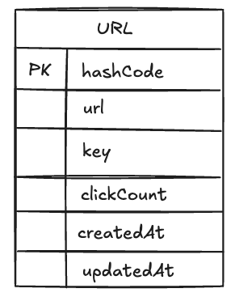

# Back-end Approach: [URL Shortening Service](https://roadmap.sh/projects/url-shortening-service)

## Table of contents

1. [Requirements Clarifications](#requirements-clarifications)
2. [System Interface Definition](#system-interface-definition)
3. [Data Model Definition](#defining-data-model)
4. [System Design and Algorithm](#system-design-and-algorithm)
    1. [URL Redirecting](#url-redirecting)
    2. [URL Shortening](#url-shortening)
5. [Identifying and Resolving Bottlenecks](#identifying-and-resolving-bottlenecks)
6. [Back-of-the-Envelope Estimation](#back-of-the-envelope-estimation)
    1. [Performance Considerations](#performance-consideration)
    2. [Traffic Estimates](#traffic-estimates)
    3. [Storage Estimates](#storage-estimates)
    4. [Bandwidth Estimates](#bandwidth-estimates)
    5. [Memory Estimates](#memory-estimates)
    6. [High-Level Estimates](#high-level-estimates)
7. [Reference Resources](#reference-resources)

## Requirements clarifications

### Functional requirement

1. **URL Redirecting:** Given a shorten URL, redirect to the original URL.
2. **URL Shortening:** Create shorten URL from the original URL.
3. **Update Short URL:** Update an existing shorten URL.
4. **Delete Short URL:** Delete an existing shorten URL.
5. **Get URL Statistics:** Retrieve statistics for the shorten URL (e.g., number of times accessed).

For this project, we will not be implementing URL expiration functionality and user authentication/authorization.

To modify or delete a short URL, a secret key provided at the time of URL generation will be used.

### Non-functional requirement

1. The system should be highly available. This is required because, if our service is down, all the URL redirections will start failing.
2. URL redirection should happen in real-time with minimal latency.
3. Shortened links should not be guessable (not predictable).

## System interface definition

### API Endpoint

The URL Shortener Service will expose the following REST API endpoints to support the basic use cases:

<details>
<summary>1. Create Short URL</summary>

- **Endpoint:** `/api/v1/shorten_urls`
- **Method:** `POST`
- **Description:** Create a shortened URL from the original URL. The response includes a unique key that can be used to modify the shortened URL and a shorten_code that will be used for redirection.
- **Request Body:**

  ```json
  {
    "original_url": "https://www.example.com/very/long/url"
  }
  ```

- **Response:**

  ```json
  {
    "key": "unique_key_for_modification",
    "shorten_code": "shortCode"
  }
  ```

</details>

<details>
<summary>2. Get Shorten URL Details</summary>

- **Endpoint:** `/api/v1/shorten_urls/{shorten_code}?key={key}`
- **Method:** `GET`
- **Description:** Get the detail of the shorten URL, include the statistics information
- **Path Parameter:**
  - `shorten_code`: The shortened URL identifier.
  - `key`: Authorize key
- **Response:**

  ```json
  {
    "original_url": "https://www.example.com/very/long/url",
    "access_count": 999
  }
  ```

</details>

<details>
<summary>3. Update Shorten URL</summary>

- **Endpoint:** `/api/v1/shorten_urls/{shorten_code}`
- **Method:** `PUT`
- **Description:** Update the original URL associated with the shortened URL.
- **Path Parameter:**
  - `shorten_code`: The shortened URL identifier.
- **Request Body:**

  ```json
  {
    "key": "unique_key_for_modification",
    "original_url": "https://www.example.com/very/long/url"
  }
  ```

- **Response:**

  ```json
  {
    "result": true
  }
  ```

</details>

<details>
<summary>4. Delete Shorten URL</summary>

- **Endpoint:** `/api/v1/shorten_urls/{shorten_code}`
- **Method:** `DELETE`
- **Description:** Delete the shortened URL.
- **Path Parameter:**
  - `shorten_code`: The shortened URL identifier.
- **Request Body:**

  ```json
  {
    "key": "unique_key_for_modification"
  }
  ```

- **Response:**

  ```json
  {
    "result": true
  }
  ```

</details>

<details>
<summary>5. Redirect Shorten URL</summary>

- **Endpoint:** `/{shorten_code}`
- **Method:** `GET`
- **Description:** Redirect to the original URL.
- **Path Parameter:**
  - `shorten_code`: The shortened URL identifier.
- **Response:**
  - **Status Code:** `302 Found`
  - **Headers:**
    - `Location`: The original URL

</details>

## Defining data model



Figure 3: Data model for URL shortening service

## System Design and Algorithm

### URL Redirecting

There are two ways to handle URL redirection: using HTTP status codes 301 and 302.

1. **301 Moved Permanently:**
   - Indicates the URL has been permanently moved.
   - Browsers cache the redirection and search engines update their indexes.
   - Not suitable for frequently changing URLs or tracking clicks.

2. **302 Found (Temporary Redirect):**
   - Indicates the URL is temporarily located at a different URL.
   - Browsers do not cache the redirection and search engines do not update their indexes.
   - Suitable for frequently changing URLs and tracking clicks.

Because we want to update the URL and track clicks, we will use the 302 status code for our URL redirection.


Figure 2: Visual representation of URL redirection process

### URL Shortening

We will need to convert the long URL to a short code, and the short code could be mapped back to the long URL

```https://www.example.com/very/long/url``` -> ```<<baseURL>>/{shortCode}```

We will be doing that via a hash function, the long URL will be hash to be a short code: ```shortCode = hashFx(longURL)```

## Identifying and resolving bottlenecks

## Back-of-the-envelope estimation

### Performance Consideration

- Assuming a medium URL has 10,000 clicks, while the most popular URLs have millions of clicks.
- Assuming 500 million new URLs per month.
- The maximum size of a link is 2048 characters (2048 bytes), but let's assume the average length of a link is around 77 bytes (source: [Typical URL lengths for storage calculation purposes](https://stackoverflow.com/questions/6168962/typical-url-lengths-for-storage-calculation-purposes-url-shortener)).
- Our system supports tracking statistics of the shortened URLs, so the ratio of read to write operations could be 1:1.

### Traffic estimates

### Storage estimates

### Bandwidth estimates

### Memory estimates

### High-level estimates

## Reference resources

- [TinyURL + PasteBin | Systems Design Interview Questions With Ex-Google SWE](https://www.youtube.com/watch?v=5V6Lam8GZo4&list=PLjTveVh7FakJOoY6GPZGWHHl4shhDT8iV)
- [Designing a URL Shortening Service like TinyURL](https://www.designgurus.io/course-play/grokking-the-system-design-interview/doc/designing-a-url-shortening-service-like-tinyurl)
- [Back-Of-The-Envelope Estimation / Capacity Planning | ByteByteGo](https://www.youtube.com/watch?v=UC5xf8FbdJc&ab_channel=ByteByteGo)
