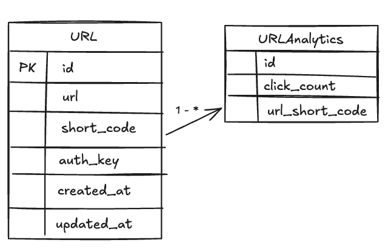
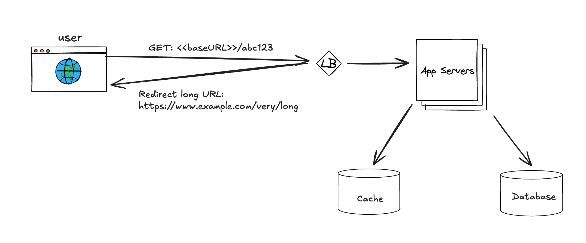

# Back-end Approach: [URL Shortening Service](https://roadmap.sh/projects/url-shortening-service)

## Table of contents

1. [Requirements Clarifications](#requirements-clarifications)
2. [System Interface Definition](#system-interface-definition)
3. [Data Model Definition](#defining-data-model)
4. [System Design and Algorithm](#system-design-and-algorithm)
    1. [URL Redirecting](#url-redirecting)
    2. [URL Shortening](#url-shortening)
5. [Identifying and Resolving Bottlenecks](#identifying-and-resolving-bottlenecks)
6. [Back-of-the-Envelope Estimation](#back-of-the-envelope-estimation)
    1. [Performance Considerations](#performance-consideration)
    2. [Traffic Estimates](#traffic-estimates)
    3. [Storage Estimates](#storage-estimates)
    4. [Bandwidth Estimates](#bandwidth-estimates)
    5. [Memory Estimates](#memory-estimates)
    6. [High-Level Estimates](#high-level-estimates)
7. [Reference Resources](#reference-resources)

## Requirements clarifications

### Functional requirement

1. **URL Redirecting:** Given a shorten URL, redirect to the original URL.
2. **URL Shortening:** Create shorten URL from the original URL.
3. **Update Short URL:** Update an existing shorten URL.
4. **Delete Short URL:** Delete an existing shorten URL.
5. **Get URL Statistics:** Retrieve statistics for the shorten URL (e.g., number of times accessed).

For this project, we will not be implementing URL expiration functionality and user authentication/authorization.

To modify or delete a short URL, a secret key provided at the time of URL generation will be used.

### Non-functional requirement

1. The system should be highly available. This is required because, if our service is down, all the URL redirections will start failing.
2. URL redirection should happen in real-time with minimal latency.

## Back-of-the-envelope estimation

### Performance Consideration

- Assuming a medium URL has 10,000 clicks, while the most popular URLs have millions of clicks.
- 100 million URLs are generated per day
- The service is expected to operate for at least 10 years, resulting in the generation of approximately 360 billion links.
- The maximum size of a link is 2048 characters (2048 bytes), but let's assume the average length of a link is around 77 bytes (source: [Typical URL lengths for storage calculation purposes](https://stackoverflow.com/questions/6168962/typical-url-lengths-for-storage-calculation-purposes-url-shortener)).
- Our system supports tracking statistics of the shortened URLs, so the ratio of read to write operations could be 1:1.

### Traffic estimates

### Storage estimates

### Bandwidth estimates

### Memory estimates

### High-level estimates

## System interface definition

### API Endpoint

The URL Shortener Service will expose the following REST API endpoints to support the basic use cases:

<details>
<summary>1. Create Short URL</summary>

- **Endpoint:** `/api/v1/shorten_urls`
- **Method:** `POST`
- **Description:** Create a shortened URL from the original URL and the short code defined by the user. The response includes a unique key that can be used to modify the shortened URL.
- **Request Body:**

  ```json
  {
    "original_url": "https://www.example.com/very/long/url",
    "short_code": "example"
  }
  ```

- **Response:**

  ```json
  {
    "key": "unique_key_for_modification",
  }
  ```

</details>

<details>
<summary>2. Get Shorten URL Details</summary>

- **Endpoint:** `/api/v1/shorten_urls/{shorten_code}?key={key}`
- **Method:** `GET`
- **Description:** Get the detail of the shorten URL, include the statistics information
- **Path Parameter:**
  - `shorten_code`: The shortened URL identifier.
  - `key`: Authorize key
- **Response:**

  ```json
  {
    "original_url": "https://www.example.com/very/long/url",
    "access_count": 999
  }
  ```

</details>

<details>
<summary>3. Update Shorten URL</summary>

- **Endpoint:** `/api/v1/shorten_urls/{shorten_code}`
- **Method:** `PUT`
- **Description:** Update the original URL associated with the shortened URL.
- **Path Parameter:**
  - `shorten_code`: The shortened URL identifier.
- **Request Body:**

  ```json
  {
    "key": "unique_key_for_modification",
    "original_url": "https://www.example.com/very/long/url"
  }
  ```

- **Response:**

  ```json
  {
    "result": true
  }
  ```

</details>

<details>
<summary>4. Delete Shorten URL</summary>

- **Endpoint:** `/api/v1/shorten_urls/{shorten_code}`
- **Method:** `DELETE`
- **Description:** Delete the shortened URL.
- **Path Parameter:**
  - `shorten_code`: The shortened URL identifier.
- **Request Body:**

  ```json
  {
    "key": "unique_key_for_modification"
  }
  ```

- **Response:**

  ```json
  {
    "result": true
  }
  ```

</details>

<details>
<summary>5. Redirect Shorten URL</summary>

- **Endpoint:** `/{shorten_code}`
- **Method:** `GET`
- **Description:** Redirect to the original URL.
- **Path Parameter:**
  - `shorten_code`: The shortened URL identifier.
- **Response:**
  - **Status Code:** `302 Found`
  - **Headers:**
    - `Location`: The original URL

</details>

## Defining data model



Figure 3: Data model for URL shortening service

**What database to use?**

Since we anticipate storing billions of rows, and we don’t need to use relationships between objects – a NoSQL store like DynamoDB, Cassandra or Riak is a better choice. A NoSQL choice would also be easier to scale.

## High-level design



Figure 4: High-level architecture for URL shortening service

## System Design and Algorithm

### URL Redirecting

There are two ways to handle URL redirection: using HTTP status codes 301 and 302.

1. **301 Moved Permanently:**
   - Indicates the URL has been permanently moved.
   - Browsers cache the redirection and search engines update their indexes.
   - Not suitable for frequently changing URLs or tracking clicks.

2. **302 Found (Temporary Redirect):**
   - Indicates the URL is temporarily located at a different URL.
   - Browsers do not cache the redirection and search engines do not update their indexes.
   - Suitable for frequently changing URLs and tracking clicks.

Because we want to update the URL and track clicks, we will use the 302 status code for our URL redirection.


Figure 2: Visual representation of URL redirection process

### Cache

The cache is used to store frequently accessed links. Before querying the backend storage, the application servers can quickly check if the cache contains the desired URL.

#### Cache memory capacity

To estimate the cache memory capacity required for our URL shortening service, we need to consider the following factors:

1. **Number of URLs to be cached:** Let's assume we want to cache the top 1% of the most frequently accessed URLs in a month. Given that we generate 100 million URLs per day, over a month (30 days), we will have approximately 3 billion URLs. 1% of 3 billion is 30 million URLs.

2. **Average size of a URL:** As mentioned earlier, the average length of a URL is around 77 bytes.

3. **Metadata storage:** In addition to the URL itself, we need to store metadata such as access count, timestamps, and other relevant information. Let's assume an additional 50 bytes per URL for metadata.

4. **Total size per URL:** The total size per URL entry in the cache would be 77 bytes (URL) + 50 bytes (metadata) = 127 bytes.

5. **Total cache size:** To store 30 million URLs, the total cache size required would be 30 million * 127 bytes = 3.81 billion bytes, which is approximately 3.81 GB.

Therefore, we would need around 3.81 GB of cache memory to store the top 1% of the most frequently accessed URLs in a month for our URL shortening service.

#### Cache eviction policy

The Least Recently Used (LRU) eviction policy would best fit our needs. This policy ensures that the least recently accessed URLs are evicted first, making room for new entries. This is suitable for our use case as it keeps the most frequently accessed URLs in the cache.

#### How does cache enhance performance during analytics processing?

A write-through cache is a caching strategy where data is written to both the cache and the underlying storage simultaneously. This ensures that the cache is always consistent with the storage, but it can introduce some latency due to the double write operation. This strategy is useful when data consistency is critical.

For more information, refer to this [link](https://www.techtarget.com/whatis/definition/write-through#:~:text=Write%2Dthrough%20cache%2C%20as%20the,to%20the%20final%20storage%20asset).

## Identifying and resolving bottlenecks

### Find duplicated short code

1. Indexing the URL table by shortCode
2. Bloom filter

## Reference resources

- [TinyURL + PasteBin | Systems Design Interview Questions With Ex-Google SWE](https://www.youtube.com/watch?v=5V6Lam8GZo4&list=PLjTveVh7FakJOoY6GPZGWHHl4shhDT8iV)
- [Designing a URL Shortening Service like TinyURL](https://www.designgurus.io/course-play/grokking-the-system-design-interview/doc/designing-a-url-shortening-service-like-tinyurl)
- [Back-Of-The-Envelope Estimation / Capacity Planning | ByteByteGo](https://www.youtube.com/watch?v=UC5xf8FbdJc&ab_channel=ByteByteGo)
