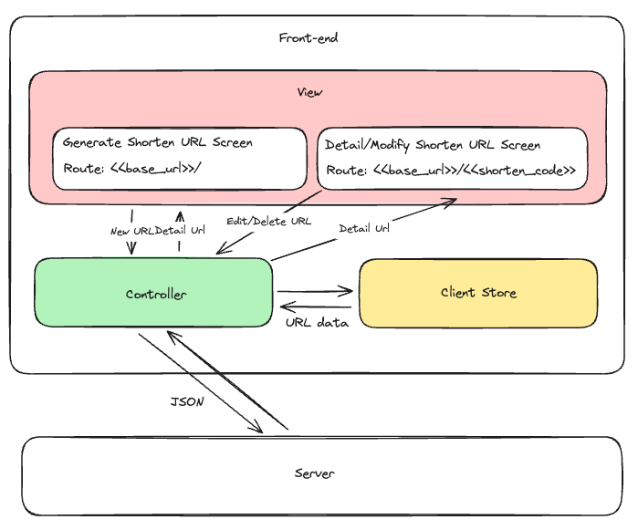

# Front-end Approach: URL Shortener Service

Following the [RADIO framework](https://www.greatfrontend.com/system-design/framework)

*The requirements outlined in the roadmap.sh ([URL Shortening Service](https://roadmap.sh/projects/url-shortening-service)) are clear, but I would like to elaborate on them further.*

## Table of Contents

1. [R: Requirements Exploration](#r-requirements-exploration)
   - [Q&A for URL Shortener Service](#qa-for-url-shortener-service)
   - [Basic Use Cases](#basic-use-cases)
   - [Back of the Envelope Estimation](#back-of-the-envelope-estimation)
2. [A: Architecture/High-level Design](#a-architecturehigh-level-design)
3. [D: Data Model](#d-data-model)
4. [I: Interface Definition (API)](#i-interface-definition-api)
5. [O: Optimizations and Deep Dive](#o-optimizations-and-deep-dive)

## R: Requirements Exploration

// TODO

## A: Architecture/High-level Design

Figure 2: Front-end architecture diagram

### Rendering appoarch

We will be using static page rendering

Static Page Rendering Approach

> Due to the simple use case of the front end and the lack of requirement for highly interactive features, we will be using a static page rendering approach.
>
> This approach will allow us to serve the necessary HTML, CSS, and JavaScript files directly from the server without the need for complex client-side rendering or dynamic content generation.
>
> Static page rendering is efficient and suitable for our needs, ensuring quick load times and ease of maintenance.

Other approach

> **Server-side rendering (SSR):**
>
> Rendering the HTML on the server side, which is the most traditional way. Best for static content that require SEO and does not require heavy user interaction. Websites like blogs, documentation sites, e-commerce websites are built using SSR.
>
> **Client-side rendering (CSR):**
>
> Rendering in the browser, by dynamically adding DOM elements into the page using JavaScript. Best for interactive content. Applications like dashboards, chat apps are built using CSR.

## D: Data Model

## I: Interface Definition (API)

## O: Optimizations and Deep Dive
